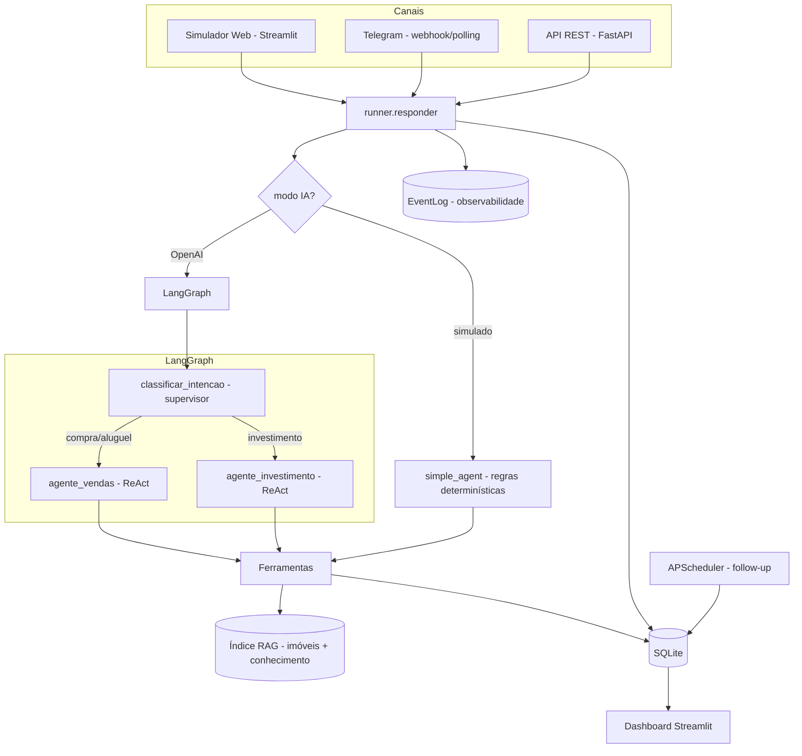
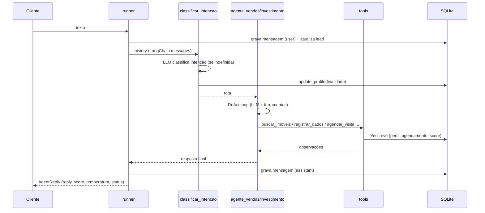

# Arquitetura da Solução — Lária (Agente SDR Imobiliário)

> Tech Challenge — Fase 5 (Hackathon FIAP · 8IADT)
> **Aluno:** Felippe de Barros Ribeiro — **RM:** 369425

## 1. Visão geral

A solução é uma **POC de agente SDR** para uma imobiliária. O princípio de design central é
**separar o núcleo de IA do canal**: qualquer canal (simulador web, Telegram, WhatsApp, API)
chama uma única função — `app.agent.runner.responder(external_id, texto, canal)` — e recebe a
resposta. Trocar ou adicionar canal não toca na lógica de negócio.

## 2. Componentes

| Camada | Módulo | Responsabilidade |
|---|---|---|
| Canal | `app/channels/telegram.py`, `dashboard/pages/1_Simulador.py` | Traduzir payload do canal ↔ `runner` |
| Entrada | `app/agent/runner.py` | Persistir mensagem, escolher motor, devolver `AgentReply` |
| Orquestração | `app/agent/graph.py` | LangGraph: supervisor + 2 agentes ReAct especializados |
| Motor simulado | `app/agent/simple_agent.py` | Reproduz a jornada sem OpenAI (demo/CI) |
| Ferramentas | `app/agent/tools.py` | Funções chamáveis pelo agente + heurísticas de extração |
| RAG | `app/rag/vector_store.py`, `app/rag/retriever.py` | Índice vetorial NumPy; 2 coleções; filtro estruturado + semântico |
| Domínio | `app/services/*` | `leads` (scoring), `scheduling`, `followup`, `summary` |
| Persistência | `app/db/*` | SQLModel/SQLite: leads, mensagens, agendamentos, resumos, eventos |
| Observabilidade | `app/observability/tracing.py` | `EventLog` (tokens, custo, latência, nó) + logs JSON |
| API | `app/main.py` | REST + lifespan (init DB, scheduler) |
| UI | `dashboard/` | Visão geral, Simulador, Leads, Agendamentos, Follow-up, Observabilidade |

## 3. Fluxo de uma mensagem (modo OpenAI)

## 4. RAG

- **Embeddings**: `text-embedding-3-small` (real) ou *hashing trick* determinístico (simulado).
- **Store**: matriz NumPy normalizada + cosseno; persistida em `.npz` + `.json`. Sem dependências
  nativas → portável (Windows/Linux/CI).
- **Coleção `imoveis`**: 1 documento por imóvel; busca combina **similaridade semântica** da
  descrição com **filtro estruturado** (`finalidade`, `zona`, `bairro`, faixa de `preço`, `quartos`).
  Fallback para busca puramente semântica se o filtro zerar.
- **Coleção `conhecimento`**: cartilhas em `data/base_conhecimento/*.md` divididas em chunks por
  seção; a resposta cita a **fonte** (`financiamento`, `locacao`, `investimento`, ...).

### Caminho de produção
Trocar `VectorStore` por **pgvector** (Postgres) mantendo a interface `build/search`. Os metadados
já estão no formato de filtro (`$in`, `$gte`, `$lte`), mapeável para `WHERE` SQL.

## 5. Lead scoring (explicável)

`app/services/leads.py::SCORE_RUBRICA` — 7 critérios, 0–100, cada um com rótulo:

| Critério | Pontos |
|---|---|
| Intenção identificada | 15 |
| Orçamento / ticket definido | 20 |
| Região definida | 15 |
| Nº de dormitórios | 10 |
| Urgência (alta 20 / média 10 / baixa 4) | ≤20 |
| Contato para retorno | 10 |
| Forma de pagamento / financiamento | 10 |

`≥70` → quente/qualificado · `40–69` → morno · `<40` → frio. O painel mostra o *breakdown*,
então o corretor entende **por que** um lead está no topo da fila.

## 6. Follow-up automático

`APScheduler` (intervalo configurável) chama `executar_ciclo()`:
seleciona leads com última mensagem do **cliente** há > `FOLLOWUP_AFTER_HOURS`, status em aberto e
`< FOLLOWUP_MAX_ATTEMPTS`; gera mensagem contextual (LLM) mantendo o histórico; registra como
mensagem de saída e incrementa a tentativa. Num canal real, o mesmo ponto envia via Telegram/WhatsApp.

## 7. Observabilidade

Cada nó, ferramenta e chamada de LLM grava um `EventLog` com `tokens_in/out`, `cost_usd`
(tabela de preços em `app/llm.py`), `latency_ms` e `data`. Logs são JSON (stdout) — prontos para
um coletor (Loki/CloudWatch). O dashboard agrega custo, latência por etapa e volume por tipo.

## 8. Segurança e responsabilidade

- Sem parecer de crédito/jurídico definitivo; decisão final sempre com humano (prompt + `encaminhar_para_corretor`).
- Coleta mínima de PII; `.env` fora do versionamento; CORS restringível.
- Dúvidas de processo respondidas **só** com a base de conhecimento (reduz alucinação) e com citação de fonte.
- `recursion_limit` no agente ReAct evita loop infinito de ferramentas; fallback de erro nunca deixa o cliente sem resposta.

## 9. Escala (evolução)

| Hoje (POC) | Produção |
|---|---|
| SQLite | Postgres + pgvector |
| Índice NumPy em arquivo | pgvector / OpenSearch |
| APScheduler in-process | worker dedicado (Celery/RQ) + fila |
| Simulador web | Telegram/WhatsApp Business API |
| 1 processo | API stateless atrás de load balancer; agente idempotente por `external_id` |
| EventLog em SQLite | OpenTelemetry + Langfuse/Grafana |
