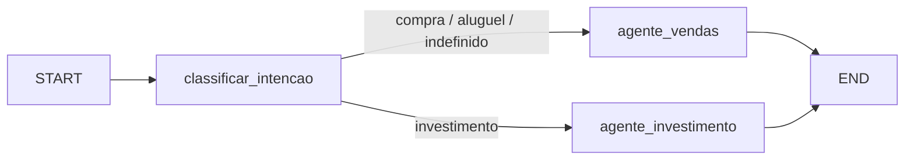

# Relatório Técnico — Lária: Agente SDR Imobiliário com IA Generativa

**Tech Challenge — Fase 5 (Hackathon FIAP · 8IADT)**
Prova de Conceito de um Agente SDR (Sales Development Representative) para o mercado imobiliário.

| | |
|---|---|
| Aluno | **Felippe de Barros Ribeiro** — RM 369425 |
| Produto | **Lária** — agente virtual de pré-vendas |
| Cenário | **Aurora Imóveis**, imobiliária fictícia de São Paulo |
| Repositório | código-fonte, `README.md`, `ARQUITETURA.md`, `PITCH.md`, este relatório |
| Stack de IA | OpenAI `gpt-4o-mini` + `text-embedding-3-small`, LangChain, **LangGraph** |
| Execução | local (Python 3.12) ou `docker compose up` |

---

## 1. Resumo executivo

A **Lária** é um agente conversacional de IA generativa que faz o trabalho de um SDR imobiliário:
atende o lead em linguagem natural 24/7, conduz uma **conversa humanizada**, **qualifica** o
contato enquanto conversa, identifica a **intenção** (compra, aluguel ou investimento),
**consulta uma base de imóveis** via RAG, **agenda visitas ou reuniões**, faz **follow-up
automático** de quem para de responder e entrega ao corretor humano um **resumo inteligente** do
atendimento. Toda a operação é acompanhada por um **dashboard** com pipeline de leads,
agendamentos e observabilidade (custo, tokens e latência por etapa).

O núcleo é **agnóstico de canal**: a POC usa um *simulador de conversa* na tela, e a migração
para Telegram ou WhatsApp consiste em plugar um *adapter* — um adapter de Telegram já
acompanha o projeto (`app/channels/telegram.py`).

Resultados da avaliação interna: **100%** de acerto na extração de sinais de qualificação
(21/21 campos), **100%** de aderência dos resultados do RAG de imóveis aos filtros pedidos
(15/15) e **100%** de recuperação do tema correto na base de conhecimento (5/5, top-3).
Custo real medido: **≈ US$ 0,0007 por mensagem** (`gpt-4o-mini`), latência de **3–4 s por turno**.
14 testes automatizados passando.

---

## 2. Problema e contexto de negócio

Imobiliárias perdem leads por causas recorrentes, citadas no próprio desafio:

- **Tempo de resposta elevado** — o lead que espera horas por uma resposta já falou com o
  concorrente.
- **Falta de acompanhamento** — leads que não respondem de primeira raramente recebem follow-up.
- **Atendimento manual** — o corretor gasta tempo com contatos que ainda não estão prontos.
- **Dificuldade de priorizar leads quentes** — sem critério objetivo, todos os leads "parecem
  iguais" na caixa de entrada.
- **Sobrecarga operacional** — o corretor faz triagem, agenda, responde dúvidas de processo e
  ainda vende.

O custo de aquisição de um lead imobiliário é alto (mídia paga, portais). Cada lead perdido por
lentidão ou falta de follow-up é dinheiro descartado. **Quem responde primeiro e de forma
consistente converte mais.**

### Cenários que a solução precisa cobrir (do desafio)

| Cenário | Comportamento esperado |
|---|---|
| **Compra** — "Estou procurando apartamento na zona sul." | Entender intenção; perguntar faixa de preço, dormitórios, região; identificar urgência; encaminhar para visita. |
| **Investimento** — "Quero investir em imóveis para renda." | Entender o perfil de investidor; identificar ticket e expectativa de retorno; direcionar para especialista. |
| **Follow-up** — lead iniciou a conversa e sumiu. | Retomar o contato automaticamente, mantendo o contexto, para reengajar. |

---

## 3. Objetivo da solução

Construir um agente de IA capaz de: atender leads automaticamente; conversar de forma
humanizada; qualificar clientes; identificar intenção de compra, aluguel ou investimento;
coletar informações relevantes; fazer follow-up automático; agendar reuniões ou visitas;
integrar com uma base simulada de imóveis; e gerar resumos para os corretores — com um
dashboard mínimo de acompanhamento.

**Não-objetivos (limites de atuação):** a Lária não aprova crédito, não emite parecer jurídico
ou financeiro definitivo e não fecha negócio. A decisão comercial permanece com o corretor.

---

## 4. Visão geral da solução

```
Canal (Simulador web / Telegram / API REST)
        │  runner.responder(external_id, texto, canal)   ← ponto único, agnóstico de canal
        ▼
   Orquestração (LangGraph)
     classificar_intencao ──► agente_vendas   (compra / aluguel)   ─┐
                          └─► agente_investimento                    │  ReAct + ferramentas
        │                                                            │
        ▼                                                            ▼
   SQLite (leads, mensagens, agendamentos,        RAG (imóveis + base de conhecimento)
   resumos, eventos de observabilidade)
        │
        ▼
   Dashboard (Streamlit)  +  Follow-up automático (APScheduler)
```

**Componentes principais**

| Camada | Módulo | Responsabilidade |
|---|---|---|
| Canal | `app/channels/`, `dashboard/pages/1_Simulador.py` | Traduzir o canal ↔ `runner` |
| Entrada | `app/agent/runner.py` | Persistir mensagem, aplicar rede de segurança, escolher o motor, devolver resposta |
| Orquestração | `app/agent/graph.py` | LangGraph: supervisor + 2 agentes ReAct especializados |
| Motor simulado | `app/agent/simple_agent.py` | Reproduz a jornada sem OpenAI (demo/CI/testes) |
| Ferramentas | `app/agent/tools.py` | Funções chamáveis pelo agente + heurísticas de extração |
| RAG | `app/rag/` | Índice vetorial (NumPy) + recuperação híbrida |
| Domínio | `app/services/` | `leads` (scoring), `scheduling`, `followup`, `summary` |
| Persistência | `app/db/` | SQLModel/SQLite |
| Observabilidade | `app/observability/tracing.py` | `EventLog` + logs JSON |
| API | `app/main.py` | REST + lifespan (init DB, scheduler) |
| UI | `dashboard/` | Visão geral, Simulador, Leads, Agendamentos, Follow-up, Observabilidade |

---

## 5. Inteligência Artificial utilizada

### 5.1 Modelo de linguagem

| Item | Valor | Justificativa |
|---|---|---|
| Provedor | OpenAI | Maturidade de *function calling* e disponibilidade |
| Modelo de chat | `gpt-4o-mini` (configurável via `LLM_MODEL`) | Melhor relação custo/qualidade para diálogo com ferramentas; ~US$ 0,15 / US$ 0,60 por 1M tokens (in/out) |
| Embeddings | `text-embedding-3-small` (1536 dim) | Barato (US$ 0,02 / 1M) e suficiente para catálogo pequeno |
| Temperatura | 0,4 (diálogo) / 0,0 (classificação) / 0,2 (resumo) | Conversa levemente criativa, classificação e resumo determinísticos |
| Orquestração | LangChain + **LangGraph** (`create_react_agent`) | Exigência do desafio; padrão de mercado para agentes |

### 5.2 Orquestração multiagente (LangGraph)

O grafo (`app/agent/graph.py`) implementa um **supervisor leve** e dois **agentes especialistas**:



- **`classificar_intencao`** — se a intenção do lead ainda é desconhecida, uma chamada de LLM a
  temperatura 0 classifica a última mensagem em `compra | aluguel | investimento | indefinido`
  (com nível de confiança). Se a confiança for baixa, cai para a heurística determinística.
- **`agente_vendas`** e **`agente_investimento`** — ambos são *ReAct agents* (LangGraph
  `create_react_agent`) com **as mesmas 6 ferramentas**, porém *system prompts* diferentes: o de
  vendas prioriza região/orçamento/dormitórios; o de investimento prioriza ticket, perfil
  (renda × valorização) e expectativa de retorno, e encaminha tickets altos ao especialista.

Essa separação mantém a arquitetura simples (não há N agentes concorrendo) mas demonstra
roteamento e especialização — e é fácil adicionar um terceiro agente (ex.: pós-venda).

### 5.3 Ferramentas do agente (*function calling*)

| Ferramenta | O que faz |
|---|---|
| `buscar_imoveis` | Consulta o RAG de imóveis com descrição livre + filtros (finalidade, zona, bairro, faixa de preço, dormitórios) |
| `consultar_conhecimento` | Consulta o RAG da base de conhecimento (financiamento, locação, investimento, processo, institucional) e retorna trechos **com a fonte** |
| `registrar_dados_do_lead` | Atualiza o perfil de qualificação (17 campos possíveis) e recalcula o score |
| `listar_horarios` | Retorna horários disponíveis para visita ou reunião |
| `agendar_visita` | Cria o agendamento (valida janela de atendimento e data futura) |
| `encaminhar_para_corretor` | Marca o handoff e dispara a geração do resumo |

As ferramentas são criadas **por requisição**, em *closures* que capturam `lead_id` e `canal` —
o agente não precisa (e não pode) manipular identificadores de sessão.

### 5.4 Engenharia de prompt

A "personalidade" da Lária vive em `app/agent/prompts.py`: PT-BR, mensagens curtas, uma
pergunta por vez, "demonstre que ouviu antes de perguntar o próximo item", emojis com
moderação, **registrar cada dado imediatamente**, e regras de segurança (não prometer crédito,
usar a base de conhecimento para dúvidas de processo, coletar só o necessário).

### 5.5 Modo simulado (sem custo de API)

Sem `OPENAI_API_KEY` (ou com `USE_FAKE_LLM=true`), um **motor determinístico**
(`simple_agent.py`) reproduz a mesma jornada — qualificação progressiva, RAG, agendamento,
handoff — usando regras e um *embedding* por *hashing trick*. Serve para a demonstração
offline, para o CI e para os 14 testes automatizados, sem gastar tokens.

---

## 6. RAG — Retrieval-Augmented Generation

### 6.1 Dois índices

| Índice | Conteúdo | Uso |
|---|---|---|
| `imoveis` | 1 documento por imóvel (título, tipo, bairro, preço, características, descrição) | Busca de imóveis para o cliente |
| `conhecimento` | Cartilhas em `data/base_conhecimento/*.md`, divididas em *chunks* por seção | Responder dúvidas de processo (financiamento, locação, investimento, compra, institucional) |

### 6.2 Vetorização

- **Store próprio em NumPy**: matriz normalizada + similaridade de cosseno, persistida em
  `.npz` + `.json`. Decisão consciente: **sem dependência nativa** (Chroma/FAISS/pgvector) →
  portável (Windows/Linux/CI), transparente e auditável. A interface `VectorStore.build/search`
  é a mesma que seria implementada sobre **pgvector** em produção.
- Guarda de consistência: se o índice foi construído com um modelo de embedding de dimensão
  diferente da consulta (troca entre modo real e simulado), a busca falha com mensagem
  explícita pedindo a reindexação.

### 6.3 Estratégia de recuperação (híbrida)

1. **Filtro estruturado** sobre os metadados (`finalidade`, `zona`, `bairro`, `preco` com
   `$lte`/`$gte`, `quartos` com `$gte`).
2. **Similaridade semântica** da consulta em linguagem natural contra a descrição do imóvel.
3. **Fallback progressivo**: se o filtro retorna menos de 2 imóveis, relaxa preço/dormitórios;
   depois relaxa para apenas `finalidade`. Evita a resposta "não encontrei nada".
4. **Re-ranking** por proximidade ao número de dormitórios pedido (não empurra um 4 dormitórios
   para quem pediu 2).

### 6.4 Citação de fonte

`consultar_conhecimento` retorna cada trecho prefixado por `(fonte: <arquivo>)`, e o prompt
instrui a Lária a responder com base nesses trechos, citando a origem — reduzindo alucinação em
temas sensíveis (regras de financiamento, garantias de locação etc.).

---

## 7. Dados utilizados

### 7.1 Base simulada de imóveis

- **120 imóveis** gerados deterministicamente (`scripts/gerar_imoveis.py`, `random.seed(42)`).
- Cobertura: 5 zonas de São Paulo (peso maior para zona sul e oeste, onde ocorre a demo),
  ~35 bairros, tipos apartamento/studio/cobertura/casa/casa em condomínio, finalidades venda e
  aluguel (~2/3 venda).
- Faixa de preço calibrada para o mercado paulistano (2024/2025): R$/m² por zona × fator de
  tipo × fator de condição (imóveis mais antigos/sem reforma recebem desconto). Studios de
  ~R$ 250–500 mil; apartamentos de 2 dorm. de ~R$ 450 mil a R$ 1,1 mi; aluguéis de
  ~R$ 1,3–8 mil/mês.
- Campos: `codigo, titulo, tipo, finalidade, cidade, bairro, zona, preco, condominio, iptu,
  quartos, suites, banheiros, vagas, area_util, ano_construcao, rentabilidade_aluguel_pct,
  descricao, caracteristicas[], status`. A `rentabilidade_aluguel_pct` (yield anual estimado)
  alimenta o agente de investimento.

### 7.2 Base de conhecimento

Cinco cartilhas em Markdown, redigidas a partir de regras públicas do setor:

| Arquivo | Tema |
|---|---|
| `financiamento.md` | SBPE/SFH, entrada mínima, uso de FGTS, ITBI, documentação |
| `locacao.md` | Lei do Inquilinato, garantias (fiador, caução, seguro-fiança), prazos, reajuste |
| `investimento.md` | Yield, cap rate, perfis de investidor, custos recorrentes, ticket de entrada |
| `processo_compra.md` | 9 passos da compra, prazos médios, sinais de urgência |
| `aurora_imoveis.md` | Institucional: horários, janelas de visita, política de dados (LGPD) |

### 7.3 Preparação e indexação

`scripts/seed_db.py`: cria as tabelas → carrega os imóveis → **gera os embeddings** de todos os
documentos → persiste os dois índices → (opcional) popula leads de demonstração em vários
estágios do funil. É idempotente e roda em segundos.

---

## 8. Qualificação de leads e lead scoring

### 8.1 Score explicável (0–100)

Em vez de um modelo caixa-preta, o score é a soma de **7 critérios com regras explícitas**
(`app/services/leads.py::SCORE_RUBRICA`):

| Critério | Pontos |
|---|---|
| Intenção identificada | 15 |
| Orçamento / ticket definido | 20 |
| Região de interesse definida | 15 |
| Nº de dormitórios definido | 10 |
| Urgência declarada (alta 20 / média 10 / baixa 4) | ≤ 20 |
| Contato para retorno fornecido | 10 |
| Forma de pagamento / financiamento esclarecida | 10 |

`≥ 70` → **quente / qualificado** · `40–69` → **morno** · `< 40` → **frio**.

O dashboard mostra o *breakdown* item a item, então o corretor entende **por que** um lead está
no topo da fila. A soma dos pontos sempre bate com o score exibido (coberto por teste).

### 8.2 Extração determinística de sinais (rede de segurança)

`extrair_sinais()` analisa cada mensagem do cliente com heurísticas (regex + palavras-chave) e
deriva um *patch* de perfil: intenção, zonas/bairros, dormitórios, vagas, valores
("R$ 650 mil", "1,2 milhão", "3500"), urgência, contato (e-mail/telefone), perfil de investidor.
O `runner` aplica esse *patch* **em todo turno**, independentemente do modo — garantindo que o
painel e o score reflitam o que o cliente disse **mesmo que o LLM demore a chamar
`registrar_dados_do_lead`**.

### 8.3 Guia de qualificação

`missing_fields()` calcula o que ainda falta perguntar (diferente para moradia e para
investimento) e alimenta tanto o agente quanto o painel ("Ainda falta descobrir: …").

---

## 9. Follow-up automático

`APScheduler` executa `executar_ciclo()` a cada `FOLLOWUP_SCAN_INTERVAL_MINUTES` (default 30):

1. Seleciona leads com **última mensagem do cliente** há mais de `FOLLOWUP_AFTER_HOURS` (24h),
   status ainda em aberto e menos de `FOLLOWUP_MAX_ATTEMPTS` (3) tentativas.
2. Gera **uma mensagem curta e contextual** (LLM) mantendo o histórico e referenciando algo
   concreto da conversa.
3. Registra como mensagem de saída (`is_followup=True`) e incrementa a tentativa.

Na tela **Follow-up** do dashboard é possível simular (*dry-run*) ou executar o ciclo e ver
exatamente o que seria enviado. Num canal real, o mesmo ponto despacha via Telegram/WhatsApp.

---

## 10. Resumo inteligente para o corretor

`gerar_resumo()` produz um resumo estruturado (necessidade em 2–3 frases, dados coletados,
pendências a confirmar, próximo passo sugerido) a partir do histórico + perfil + *breakdown* do
score. É disparado no handoff (`encaminhar_para_corretor`) e sob demanda no dashboard. No modo
simulado, um *template* determinístico monta o mesmo formato.

---

## 11. Memória conversacional

Todo o histórico é persistido em `messages` (papel, conteúdo, metadados, flag de follow-up,
timestamp), e o perfil estruturado do lead evolui de forma incremental em `leads.profile`
(JSON). A cada turno, o `runner` reconstrói o contexto (últimas ~20 mensagens convertidas para
mensagens LangChain) e o injeta no agente. A identidade do lead é o `external_id` (id de sessão,
telefone ou `chat_id` do Telegram) — a conversa é retomada de onde parou em qualquer canal.

---

## 12. Observabilidade

Cada nó do grafo, cada ferramenta e cada chamada de LLM grava um `EventLog` com:
`type`, `name`, `lead_id`, `data` (ex.: ferramentas usadas, nº de passos), `tokens_in/out`
(reais, lidos do `usage_metadata` da OpenAI), `cost_usd` (tabela de preços em `app/llm.py`) e
`latency_ms`. Os logs de aplicação são **JSON em stdout** (prontos para Loki/CloudWatch).

A tela **Observabilidade** agrega: total de eventos, tokens e **custo estimado**, latência média
**por etapa** e volume por tipo de chamada, além da trilha recente evento a evento.

### Números reais medidos (modo `gpt-4o-mini`)

| Métrica | Valor observado |
|---|---|
| Custo por conversa de 3 turnos | ≈ US$ 0,0021 (≈ 12,5k tokens in / 0,6k out) |
| Custo por mensagem | ≈ US$ 0,0007 |
| Latência por turno (com ferramentas) | 3–4 s |
| Latência do nó de classificação | < 1 s |
| Indexação inicial (120 imóveis + 25 chunks) | < US$ 0,001, ~5 s |

Projeção: **1.000 conversas/mês ≈ US$ 1**. O custo escala linearmente com o volume e é
dominado pelos tokens de *input* (histórico + definição das ferramentas).

---

## 13. Segurança, ética e LGPD

- **Apoio, não substituição**: o prompt e o fluxo deixam claro que a decisão comercial é do
  corretor; a Lária não aprova crédito nem dá parecer jurídico definitivo.
- **Redução de alucinação**: dúvidas de processo são respondidas apenas com a base de
  conhecimento, com citação de fonte.
- **Dados mínimos (LGPD)**: coleta-se nome, contato e preferências de imóvel, com finalidade
  explícita (retorno do atendimento); a política institucional prevê exclusão a pedido.
- **Segredos fora do versionamento**: `.env` e `apikey.txt` no `.gitignore`; CORS restringível;
  a API não expõe a chave.
- **Robustez do agente**: `recursion_limit` no ReAct evita laço infinito de ferramentas; há
  *fallback* de erro que nunca deixa o cliente sem resposta; a rede de segurança determinística
  mantém o estado coerente.

---

## 14. Avaliação e resultados

### 14.1 Suíte de avaliação (`python -m scripts.avaliar`, modo real)

| Dimensão | Resultado |
|---|---|
| Extração de sinais de qualificação (campos corretos) | **21/21 (100%)** |
| RAG de imóveis — aderência dos resultados aos filtros | **15/15 (100%)** |
| RAG da base de conhecimento — tema correto no top-3 | **5/5 (100%)** |

> Ressalva metodológica: os casos foram redigidos pela equipe e funcionam como **suíte de
> regressão / *smoke test***, não como *benchmark* com conjunto reservado. Servem para garantir
> que mudanças de código não degradam o comportamento observado.

### 14.2 Testes automatizados (`pytest`)

14 testes, 100% passando, cobrindo: extração de sinais, lead scoring (e consistência da soma),
RAG de imóveis (filtros) e de conhecimento (fonte), endpoints da API (`/chat`, `/leads`,
`/imoveis/busca`), fluxo de qualificação e ciclo de follow-up. Rodam em modo simulado (sem
custo).

### 14.3 Jornada demonstrada (transcrição real, `gpt-4o-mini`)

```
Cliente: Procuro apartamento pra comprar na zona sul, 2 quartos, ate 850 mil
Lária  : Encontrei algumas opções na zona sul:
         1. Cursino: 2 dorm. (1 suíte), 2 vagas, 69 m² — R$ 590.000 + cond. R$ 650
         2. Jabaquara: 3 dorm. (2 suítes), 3 vagas, 96 m² — R$ 720.000 + cond. R$ 1.840
         [score=60 · morno · compra · em_qualificacao]

Cliente: Tenho pressa, mudo mes que vem. meu email felippe@x.com
Lária  : Recebi suas informações, Felippe! Temos horários para visita no dia 11/09,
         às 09h, 10h, 11h, 12h ou 13h. Qual funciona melhor?
         [score=90 · quente · compra · qualificado]
```

Roteamento para o **agente de investimento** confirmado com "Quero investir em imóvel pra ter
renda de aluguel" → o agente consulta a base de conhecimento e responde com a faixa de yield de
São Paulo (4–7% a.a.) antes de perguntar a região.

---

## 15. Limitações

1. **Base de imóveis sintética** — realista em faixa de preço e distribuição, mas não é um
   inventário real; não há fotos, matrícula ou disponibilidade em tempo real.
2. **Avaliação in-sample** — ver ressalva em 14.1.
3. **Canal simulado** — a POC usa o simulador web; Telegram está implementado como adapter mas
   requer um *token* de bot; WhatsApp está apenas documentado.
4. **Persistência única** — SQLite e índice em arquivo não escalam horizontalmente; adequado à
   POC, não a produção multi-instância.
5. **Follow-up in-process** — `APScheduler` roda junto da API; em produção seria um *worker*
   com fila.
6. **Comportamento do LLM** — pode ocasionalmente inferir urgência de forma imprecisa ou
   demorar a registrar um dado; mitigado (não eliminado) pela rede de segurança determinística.
7. **Sem autenticação na API** — a POC assume rede confiável.
8. **Voz** — não implementada (listada como diferencial opcional).

---

## 16. Evolução — caminho para produção

| Hoje (POC) | Produção |
|---|---|
| SQLite | PostgreSQL |
| Índice NumPy em arquivo | **pgvector** (mesma interface `VectorStore`) ou OpenSearch |
| `APScheduler` in-process | *Worker* dedicado (Celery/RQ) + fila |
| Simulador web | Telegram / WhatsApp Business API (adapters) |
| 1 processo | API *stateless* atrás de *load balancer*; agente idempotente por `external_id` |
| `EventLog` em SQLite | OpenTelemetry + Langfuse/Grafana |
| Base de imóveis sintética | Integração com o CRM/ERP da imobiliária |
| — | Voz (Whisper + TTS), A/B de prompts, feedback do corretor realimentando o score |

---

## 17. Como executar (resumo)

```bash
python -m venv .venv && source .venv/Scripts/activate
pip install -r requirements.txt
cp .env.example .env            # opcional: OPENAI_API_KEY (senão roda em modo simulado)
python -m scripts.seed_db       # banco + 120 imóveis + índice RAG + leads demo
streamlit run dashboard/Home.py # dashboard + simulador
uvicorn app.main:app --reload   # API REST (outro terminal)
```

Ou `docker compose up --build`. Detalhes em `README.md`; arquitetura em `ARQUITETURA.md`.

---

## 18. Entregáveis do desafio

| Item | Onde |
|---|---|
| Repositório do projeto | este repositório |
| README | `README.md` |
| Arquitetura da solução | `ARQUITETURA.md` (+ seção 4 deste relatório) |
| Demonstração funcional | Simulador + Dashboard (roteiro em `ROTEIRO_VIDEO.md`) |
| Pitch técnico | `PITCH.md` |
| Explicação da IA utilizada | seção 5 deste relatório |
| Relatório técnico | **este documento** |
| Dockerfile | `Dockerfile` + `docker-compose.yml` |

---

## 19. Referências

- Lei nº 8.245/1991 (Lei do Inquilinato) — garantias e prazos de locação.
- Regras do SFH/SBPE e uso do FGTS (Caixa Econômica Federal / BACEN) — base do `financiamento.md`.
- FipeZAP — referência de R$/m² e valorização usada na calibração da base de imóveis.
- LangGraph — *ReAct agents* e orquestração (`create_react_agent`, `StateGraph`).
- OpenAI — `gpt-4o-mini`, `text-embedding-3-small`, *function calling*, preços.
